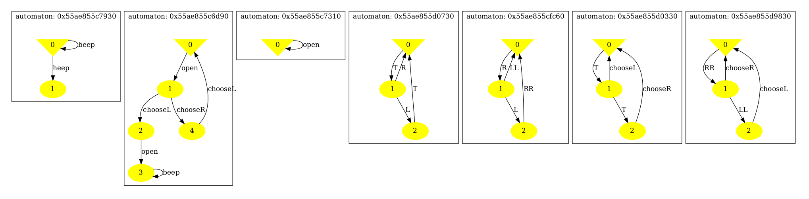
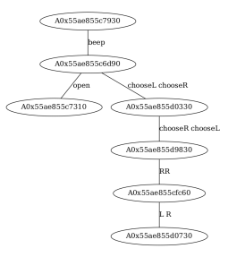

# Live-tree automata reduction tool

This is a prototype of a tool for verifying big networks of synchronising automata. The synchronisation structure of the network should form a tree.
The companion paper is [here](https://hal.archives-ouvertes.fr/hal-03811772v1).

# Compiling and usage

To compile, just run `make`. You will need graphviz to produce model
visualisations. Run `tree_reduce` to print usage.

The `examples/simple_model` directory contains a simple tree automata network.
To perform a reduction of this model copy `Makefile` and `tree_reduce` to the
`examples/simple_model` directory and then run

```
tree_reduce -m mod{0,1,2,3,4,5,6} -s acts -d
```

You should obtain three `.dot` files.

Now run `make dot` to produce three pdfs:

1. `net.pdf` is the automata network.
2. `sync.pdf` is the synchronisation topology of the network.
3. `reduced.pdf` is the result of sum-of-squares reduction of the network.

You can generate the running example of the companion paper as follows.

```
./tree_reduce -m examples/simple_model/mod{1,2,5} -s examples/simple_model/acts -d
```

# Here's the result

- _net.pdf_



- _sync.pdf_



- _reduced.pdf_


